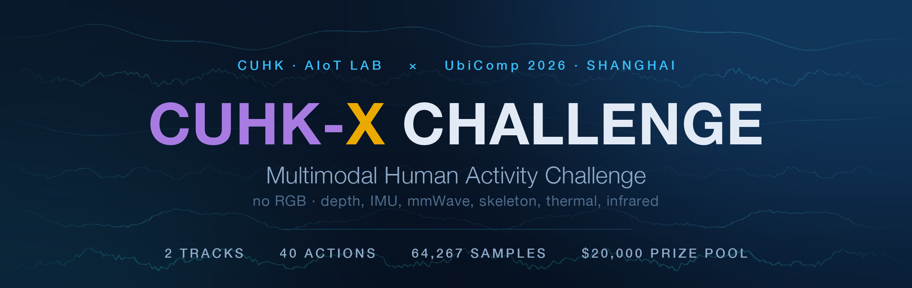
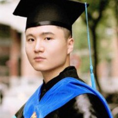
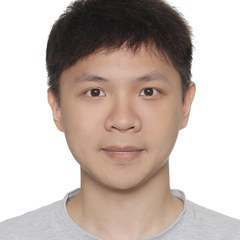
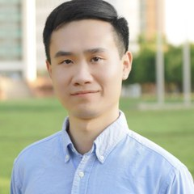
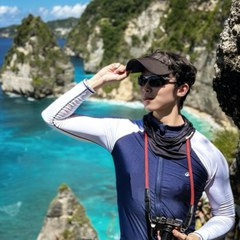

<p align="center">
  
</p>

<h3 align="center">An international, RGB-free competition on multimodal human activity<br>recognition, understanding and reasoning — finals at UbiComp 2026, Shanghai</h3>

<p align="center">
  <a href="https://openaiotlab.github.io/CUHK-X-Challenge/"></a>
  <a href="https://www.kaggle.com/competitions/cuhk-x-competition-small-model-track"></a>
  <a href="https://www.kaggle.com/competitions/cuhk-x-competition-large-model-track"></a>
  <a href="#-awards"></a>
</p>

<p align="center">
  <a href="#-timeline"></a>
  <a href="#-timeline"></a>
  <a href="https://dl.acm.org/doi/epdf/10.1145/3745756.3809209"></a>
  <a href="https://openaiotlab.github.io/CUHK-X/"></a>
</p>

<p align="center">
  <a href="https://openaiotlab.github.io/CUHK-X-Challenge/#registration"><b>📝 Register your team</b></a> &nbsp;·&nbsp;
  <a href="#-the-two-tracks"><b>🎯 Pick a track</b></a> &nbsp;·&nbsp;
  <a href="#-dataset"><b>📥 Get the data</b></a> &nbsp;·&nbsp;
  <a href="#-rules--verification"><b>📋 Read the rules</b></a> &nbsp;·&nbsp;
  <a href="#-leaderboard"><b>📊 Leaderboard</b></a>
</p>

> The **CUHK-X Multimodal Human Activity Challenge** is the first large-scale international competition that **excludes RGB data entirely**. Models learn human dynamics from **depth, IMU, mmWave radar, skeleton, thermal and infrared** streams — mirroring the deployment reality of healthcare, smart-home and elderly-care systems, where visual privacy must be preserved during training, validation *and* inference. Two parallel Kaggle tracks, USD $20,000 in prizes, finals alongside UbiComp 2026 in Shanghai.

## 🚀 Quick start

```
1. Register your team  →  openaiotlab.github.io/CUHK-X-Challenge/#registration
2. Join on Kaggle      →  create a team with the EXACT SAME name
3. Download the data   →  Hugging Face / Google Drive / Baidu Netdisk (below)
4. Submit predictions  →  the private leaderboard decides your ranking
```

> [!IMPORTANT]
> Your Kaggle team name must match the name you register on the website **exactly** — otherwise your certificate and shortlist notification cannot reach you. Registering on the website is what makes you eligible for prizes, announcements and finals invitations.

## 📌 At a glance

| | |
|---|---|
| **Host** | The Chinese University of Hong Kong · [AIoT Lab](https://github.com/openaiotlab) |
| **Platform** | Kaggle — two parallel competitions |
| **Duration** | June 20 – September 15, 2026 |
| **Finals** | UbiComp 2026 · Shanghai · October 11, 2026 |
| **Tracks** | Small Model (HAR) · Large Model (VQA) |
| **Modalities** | Depth · IMU · mmWave · Skeleton · Thermal · Infrared — **no RGB** |
| **Action classes** | 40 daily activities |
| **Benchmark tasks** | HAR (recognition) · HAU (understanding) · HARn (reasoning) |
| **Prize pool** | USD $20,000 — $10,000 per track |
| **Team size** | 1–3 members (faculty advisor not counted) |

## 🎯 The two tracks

Two independent competitions, each with its own Kaggle leaderboard, prize pool and evaluation criteria. You may enter **both**, but each individual may join only one team *per track*.

| | 🪶 **Small Model Track** | 🧠 **Large Model Track** |
|---|---|---|
| **Focus** | Lightweight HAR for the edge | LVLMs on non-RGB modalities |
| **Task** | 40-class action recognition, cross-subject | VQA over HAU & HARn — 6,160 questions, five reasoning types |
| **Primary modalities** | Depth, IMU, mmWave, skeleton, IR, thermal | Depth, thermal, IR |
| **Model constraint** | CNN / RNN / Transformer · **≤ 100 MB** · no large pretrained backbones | **No parameter limit** · LVLMs and closed-source APIs encouraged |
| **Why it matters** | Alzheimer's monitoring, fall detection, elderly care on low-power devices | Action understanding and causal reasoning without ever seeing a face |
| **Prize pool** | USD $10,000 | USD $10,000 |
| **Join** | [**Kaggle →**](https://www.kaggle.com/competitions/cuhk-x-competition-small-model-track) | [**Kaggle →**](https://www.kaggle.com/competitions/cuhk-x-competition-large-model-track) |

Both tracks share the same **cross-subject** split — train on users 1–9 & 16–24, public test on users 10–11 & 25–26, with a further private test set held out entirely.

<details>
<summary><b>Final scoring breakdown for finalists</b></summary>

| Component | Weight |
|---|---|
| Kaggle private leaderboard | 20% |
| Organizer-run private-data evaluation | 30% |
| Reproducibility (selection stage) | 10% |
| Technical report | 20% |
| Presentation | 10% |
| Model efficiency | 10% |

</details>

## 🗓️ Timeline

The challenge runs in **three stages**: a three-month Kaggle phase, a committee-run verification and private-data evaluation stage, and the Grand Finals at UbiComp 2026.

| Date | Milestone | |
|---|---|---|
| **May 23, 2026** | Website released | Full timeline, track details, dataset overview |
| **Jun 20, 2026** | 🟢 **Competition launch** | Both Kaggle tracks open; dataset publicly released |
| **Sep 15, 2026** | 🔒 **Leaderboard freeze** | Submissions close. **Top 15 per track** are notified and invited to the verification and evaluation stage |
| **Sep 18, 2026** | 📦 **Verification package due** | Top 15 per track submit code, weights, README, and S:59 UTC |
| **Sep 16–30, 2026** | 🔎 Verification & evaluation | Committee-run code/reproducibility verification and private-data evaluation in a controlled environment |
| **Oct 1, 2026** | 🎖️ Final Top 6 announced | Verified teams invited to the Grand Finals; technical report due 23:59 UTC+8 |
| **Oct 12, 2026** | 🏆 **Grand Finals · UbiComp 2026 Shanghai** | Finalist presentations (5 + 5 min Q&A) · awards ceremonies · no on-site private-test inference |

<details>
<summary><b>Stage 2 — what verification actually involves</b></summary>

The Organizing Committee runs each submitted solution in a controlled environment, following your `README.md` step by step — reproducibility is graded.

- The committee verifies code execution, reproducibility, and consistency with your Kaggle leaderboard result.
- The organizer-run **private-data evaluation** on organizer-controlled private data is the 30% private-test component of final scoring.
- If environment or execution issues arise, the committee contacts the team privately for clarification or a closed verification session.
- Teams that cannot be verified may be replaced by reserve teams according to private-leaderboard order.

Submission package, due Sep 18 23:59 UTC:

```
code/                    full training and inference code
checkpoints/model.pth    final model weights
inference.sh             single entry script: data_dir → predictions CSV
README.md                reproducibility artifact
final_submission.csv     your final Kaggle submission
honor_declaration.pdf    signed
```

</details>

## 🏆 Awards

Each track carries an independent USD $10,000 pool — the prizes below apply to **both** tracks.

| | Award | Prize |
|---|---|---|
| 🥇 | 1st Place | **$6,000** |
| 🥈 | 2nd Place | **$3,000** |
| 🥉 | 3rd Place | **$1,000** |
| 📄 | Best Report Award | Selected by review committee |
| ⭐ | Most Popular Award | Community vote / most innovative |
| 🎓 | Best Faculty Advisor Award | Advisor of the highest-scoring student team |

Beyond the prize tiers, every participating team is recognised through a **five-tier certificate system** per track. Tiers are nested — each team receives only its highest-qualifying award.

| | Certificate | Eligibility |
|---|---|---|
| 🏆 | Outstanding Award | UbiComp finals Top 6 |
| 🎖️ | Finalist Award | Kaggle private LB Top 15 |
| 🎗️ | Excellence Award | Kaggle private LB Top 15% (excl. Top 15) |
| 📜 | Distinction Award | Kaggle private LB Top 30% (excl. above) |
| ✨ | Successful Participation Award | Teams with ≥ 1 valid submission |

✈️ **Travel grants** — up to **USD $500 per finalist team** attending in person at UbiComp 2026 Shanghai, reimbursed against actual expenses. Teams unable to travel may join remotely via Zoom (organizers run the projector and coordinate live Q&A) and remain fully eligible for prizes and awards.

## 📊 Leaderboard

The [official site](https://openaiotlab.github.io/CUHK-X-Challenge/#leaderboard) shows the **top 6 teams per track**, auto-synced from Kaggle every day at **10:00 HKT** by [`.github/workflows/update-leaderboard.yml`](.github/workflows/update-leaderboard.yml) into [`leaderboard.json`](leaderboard.json).

The public leaderboard is for reference only — **the private leaderboard decides the final ranking.**

<p align="center">
  <a href="https://www.kaggle.com/competitions/cuhk-x-competition-small-model-track/leaderboard"><b>Small Model Track leaderboard →</b></a> &nbsp;·&nbsp;
  <a href="https://www.kaggle.com/competitions/cuhk-x-competition-large-model-track/leaderboard"><b>Large Model Track leaderboard →</b></a>
</p>

## 📦 Dataset

Most large vision-language models still depend almost entirely on RGB, while depth, thermal, IMU and mmWave radar remain severely underrepresented — the root cause being a lack of large-scale, high-quality *paired* multimodal data. **CUHK-X** addresses that gap.

| | |
|---|---|
| **Total samples** | 64,267 fully synchronized recordings |
| **Participants** | 30 (diverse age and gender) |
| **Environments** | 2 real-world indoor settings |
| **Action classes** | 40 daily activities |
| **Modalities in the dataset** | RGB · Depth · Thermal · Infrared · Skeleton · IMU (×5) · mmWave radar |
| **Modalities in the challenge** | everything **except RGB** |
| **Annotation** | Ground-Truth First — LLM-generated scene descriptions + human review |
| **Split** | 18 train · 4 public test · 8 private (held out) participants |

**Downloads**

| Track | Hugging Face | Google Drive | Baidu Netdisk |
|---|---|---|---|
| Small Model | [🤗 CUHK-X_Small_Model_Track](https://huggingface.co/datasets/Kevin-Pal/CUHK-X_Small_Model_Track) | [Drive](https://drive.google.com/drive/folders/1wZOPpTFLqDKjBLJGjMdOZyuJygLHbwCZ?usp=sharing) | [Netdisk](https://pan.baidu.com/s/1uvaN88D8oHKkaa5O_b4x5g?pwd=5855) (`5855`) |
| Large Model | [🤗 CUHK-X_Large_Model_Track](https://huggingface.co/datasets/Kevin-Pal/CUHK-X_Large_Model_Track) | [Drive](https://drive.google.com/drive/folders/1USLiJKosAyA7oSuxU27d-s_lxJyKKjya?usp=sharing) | [Netdisk](https://pan.baidu.com/s/10uVVQiWr5gXiiReXQxUkdQ?pwd=huxi) (`huxi`) |

Baselines, benchmark code and the in-browser data explorer live in the main dataset repo: **[openaiotlab/CUHK-X](https://github.com/openaiotlab/CUHK-X)** · [project page](https://openaiotlab.github.io/CUHK-X/).

## 📋 Rules & verification

**Eligibility.** Open to students, researchers and industry teams worldwide; cross-institution and cross-country teams are permitted. Members of the AIoT Lab and direct collaborators are ineligible for prizes. Kaggle's terms of service apply throughout. Team mergers lock 7 days before the submission deadline.

> [!WARNING]
> **Strictly forbidden in both tracks:** manual labeling of test samples · using test-set ground-truth labels in training, in any form · multi-account registration or collusion between teams.

| | Small Model Track | Large Model Track |
|---|---|---|
| Large pretrained backbones | ❌ not permitted | ✅ any pretrained model, including LVLMs |
| Closed-source APIs / LLMs during development | ❌ not permitted | ✅ encouraged |
| LLM-based pseudo-labeling of training data | ❌ not permitted | ✅ permitted |
| Prompt engineering | — | ✅ part of the expected toolkit |

**IP and code usage** (Kaggle standard). Participants **retain full copyright** on all submitted code and models. All competition data is the exclusive property of the AIoT Lab — see [`Rule/LICENSE.txt`](Rule/LICENSE.txt) and the bilingual [`Rule/IP_CLAUSES_BILINGUAL.pdf`](Rule/IP_CLAUSES_BILINGUAL.pdf). Non-finalist code is destroyed after the competition and never released publicly. Finalist teams (Top 6 per track) must open-source their solution under **Apache 2.0** within 30 days of the finals; a team unwilling to do so may decline finalist status, and the slot passes to the next-ranked team.

## 🗂️ What's in this repo

This repository hosts the challenge website (GitHub Pages) and its supporting scripts.

| Path | What it is |
|---|---|
| [`index.html`](index.html) | The entire single-page website — no build step, no framework |
| [`leaderboard.json`](leaderboard.json) | Top 6 per track, auto-synced from Kaggle |
| [`Rule/`](Rule/) | Dataset license and the bilingual IP clauses PDF |
| [`scripts/update_leaderboard.py`](scripts/update_leaderboard.py) | Fetches both Kaggle leaderboards → `leaderboard.json` |
| [`scripts/make_ip_pdf.py`](scripts/make_ip_pdf.py) | Generates the bilingual IP clauses PDF |
| [`scripts/make_readme_assets.py`](scripts/make_readme_assets.py) | Renders the banner and organizer portraits used above |
| [`photos/`](photos/) | Full-resolution organizer portraits |
| [`.github/workflows/`](.github/workflows/) | Daily leaderboard sync — 02:00 UTC / 10:00 HKT, plus manual dispatch |

The leaderboard workflow requires the `KAGGLE_USERNAME` and `KAGGLE_KEY` repository secrets.

## 👥 Organizers

**Competition Co-Chairs**

<table align="center">
<tr>
  <td align="center" width="150"><br><b>Prof. Zhenyu Yan</b></td>
  <td align="center" width="150"><br><b>Prof. Hongkai Chen</b></td>
  <td align="center" width="150"><br><b>Siyang Jiang</b></td>
</tr>
</table>

**Competition Committee**

<table align="center">
<tr>
  <td align="center" width="150"><br><b>Guangyu Chen</b></td>
  <td align="center" width="150"><br><b>Liekang Zeng</b></td>
  <td align="center" width="150"><br><b>Anlan Peng</b></td>
</tr>
<tr>
  <td align="center" width="150"><br><b>Xiang Ji</b></td>
  <td align="center" width="150"><br><b>Mu Yuan</b></td>
  <td align="center" width="150"></td>
</tr>
</table>

**Steering Committee**

<table align="center">
<tr>
  <td align="center" width="150"><br><b>Prof. Guoliang Xing</b></td>
</tr>
</table>

<p align="center"><sub>All CUHK · AIoT Lab, Department of Information Engineering</sub></p>

## 📝 Citation

If the CUHK-X dataset or this challenge supports your research, please cite the MobiSys '26 paper:

```bibtex
@inproceedings{10.1145/3745756.3809209,
  author    = {Jiang, Siyang and Yuan, Mu and Ji, Xiang and Yang, Bufang and Liu, Zeyu and Xu, Lilin and Li, Yang and He, Yuting and Dong, Liran and Lu, Wenrui and Yan, Zhenyu and Jiang, Xiaofan and Gao, Wei and Chen, Hongkai and Xing, Guoliang},
  title     = {A Large-Scale Multimodal Dataset and Benchmarks for Human Activity Scene Understanding and Reasoning},
  booktitle = {Proceedings of the 24th Annual International Conference on Mobile Systems, Applications and Services},
  series    = {MobiSys '26},
  year      = {2026},
  pages     = {352--370},
  numpages  = {19},
  publisher = {Association for Computing Machinery},
  address   = {New York, NY, USA},
  doi       = {10.1145/3745756.3809209},
  url       = {https://dl.acm.org/doi/epdf/10.1145/3745756.3809209}
}
```

## 📬 Contact

Technical questions, registration help, or anything else about the challenge:

<p align="center">
  <a href="mailto:cuhkx.competition@gmail.com"><b>cuhkx.competition@gmail.com</b></a>
</p>

<p align="center">
  <a href="https://openaiotlab.github.io/CUHK-X-Challenge/">Challenge site</a> ·
  <a href="https://openaiotlab.github.io/CUHK-X/">Dataset page</a> ·
  <a href="https://github.com/openaiotlab/CUHK-X">Dataset repo</a> ·
  <a href="https://www.kaggle.com/competitions/cuhk-x-competition-small-model-track">Kaggle · Small</a> ·
  <a href="https://www.kaggle.com/competitions/cuhk-x-competition-large-model-track">Kaggle · Large</a>
</p>

<p align="center"><sub>© 2026 CUHK-X Multimodal Human Activity Challenge · The Chinese University of Hong Kong — AIoT Lab</sub></p>
